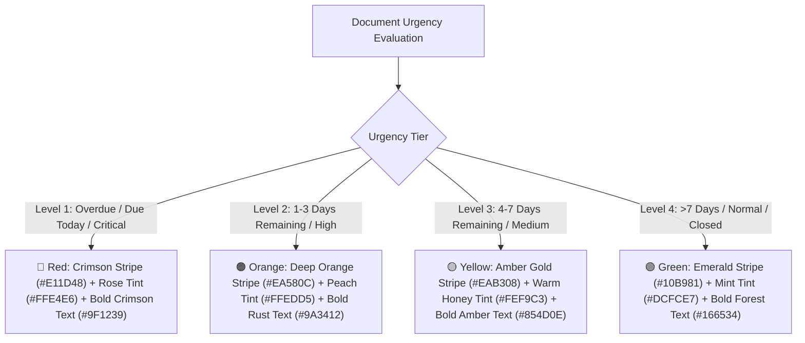

# CDTRS Technical Reference: Modern Aesthetic Urgency & SRS Color Coding Guide

This document provides a comprehensive explanation of the modern, aesthetically refined urgency row-styling system and execution queue integration.

---

## 1. Modern Urgency Visual Design

Instead of harsh solid fills or washed-out text, CDTRS utilizes a **Modern Enterprise Card-Tint + Edge Accent** design (similar to modern platforms like Linear, Notion, and GitHub):

### Visual Specifications:
| Tier | Remaining Time / Status | Left Vertical Accent Stripe (4px) | Row Background Tint | Primary Typography |
|---|---|---|---|---|
| **🔴 Level 1 (Overdue / Critical)** | $\le 0$ days, Due Today, Urgent | `#E11D48` (Deep Crimson) | `#FFE4E6` (Soft Rose Glow) | `#9F1239` (Deep Burgundy) |
| **🟠 Level 2 (High / Approaching)** | $1 - 3$ days, High Priority | `#EA580C` (Vivid Orange) | `#FFEDD5` (Soft Peach Glow) | `#9A3412` (Deep Rust) |
| **🟡 Level 3 (Medium / Standard)** | $4 - 7$ days, Medium Priority | `#EAB308` (Amber Gold) | `#FEF9C3` (Soft Honey Glow) | `#854D0E` (Deep Amber) |
| **🟢 Level 4 (Normal / Routine / Closed)** | $> 7$ days, Low, Closed | `#10B981` (Emerald Green) | `#DCFCE7` (Soft Mint Glow) | `#166534` (Deep Forest) |

---

## 2. Universal Execution Queue Integration

All execution queues and tables share this standardized urgency logic:

1. **Dashboard Execution Queue** ([`frontend/pages/dashboard.py`](file:///c:/Users/Pratiksha/Downloads/CDTRS-main_final/CDTRS-main/CDTRS-main/frontend/pages/dashboard.py)):
   - Renders live departmental and personal action items with left edge urgency stripes, glowing card-tints, and double-click opening.
2. **Director Review Queue** ([`frontend/pages/director_inbox.py`](file:///c:/Users/Pratiksha/Downloads/CDTRS-main_final/CDTRS-main/CDTRS-main/frontend/pages/director_inbox.py)):
   - Direct Executive Review queue with urgency styling and double-click review.
3. **HOD Processing Queue** ([`frontend/pages/hod_inbox.py`](file:///c:/Users/Pratiksha/Downloads/CDTRS-main_final/CDTRS-main/CDTRS-main/frontend/pages/hod_inbox.py)):
   - Departmental assignment queue with urgency styling and double-click assignment.
4. **Employee Task Queue** ([`frontend/pages/employee_tasks.py`](file:///c:/Users/Pratiksha/Downloads/CDTRS-main_final/CDTRS-main/CDTRS-main/frontend/pages/employee_tasks.py)):
   - Personal execution queue with urgency styling and double-click progress updates.
5. **Registered Documents & Priority Deadlines** ([`frontend/components/document_table.py`](file:///c:/Users/Pratiksha/Downloads/CDTRS-main_final/CDTRS-main/CDTRS-main/frontend/components/document_table.py)):
   - Core repository view with full filtering and urgency rendering.
